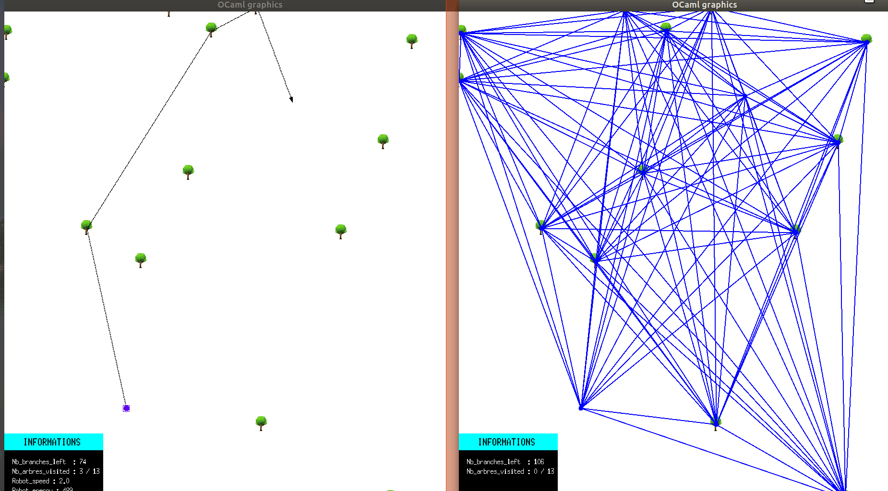
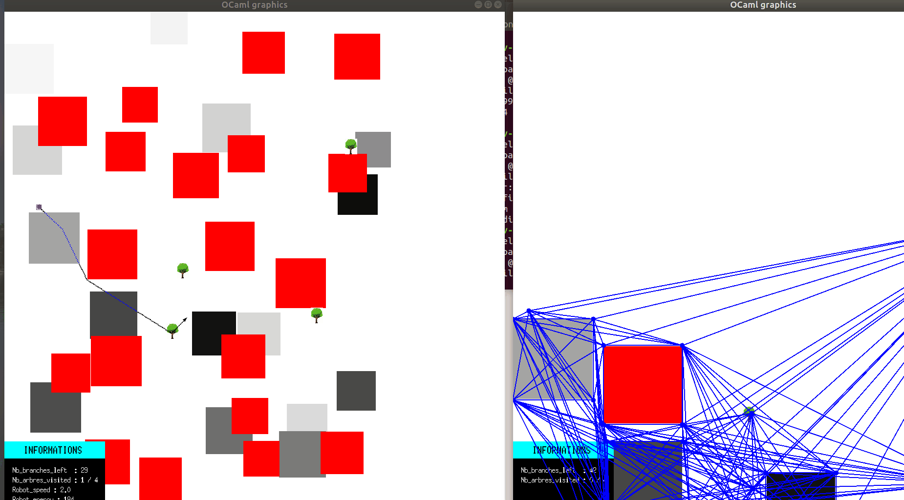
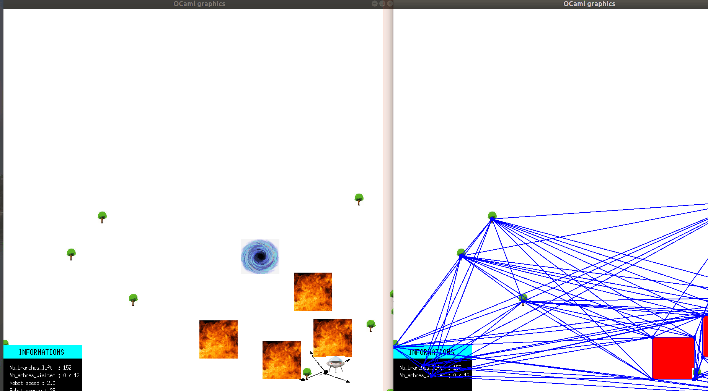

# Lambda man 
A Lambda man is a robot which is launched from a spaceship into an unknown world in order to collect as much wood as possible. The robot is discovering the world as he progresses,so he has to make constantly the right choices to collect all the wood as fast as he can.   
But, there are different kind of worlds as there are some worlds with Hell ground that the robot cannot touch otherwise he will die. 
Also, the robot is able to take advantages from suffering ground that will increase or decrease his speed. 
Finally,some worlds allow the spaceship to send a team of robot who will distribute themselves the work efficiently in order to collect all the wood faster. 
There are 21 worlds in the "tests/" repository and 4 more in the "myworld/" repository.

## How to use : Lambda Man 
To use this project,make sure you are working on a GNU/Linux distribution and have installed Opam 2.  
Also,for the graphic version (-g option),we used the [camlimages library](https://opam.ocaml.org/packages/camlimages/) so make sure to download it.  
then `$ ./configure ` will install all the project dependancies on a Opam installation.  
If everything went well , you will have the following message :  

> Congratulations! Your project is ready for development.

Run `$ eval (opam env)` to update the current shell environment.  
Now, you can compile with `$ make` and it will create an executable file called "lambda".  
Finally,you can launch the game with : 

`./lambda server -s 0.01 -v -w tests/00015-hell-and-suffering.json './lambda man -n 1  -v' ` 
as :
* the server is going to use the world "00015-hell-and-suffering.json" in the "tests/" repository where there are 20 others worlds to test. (4 others personalized worlds are available in the "myworld/" repository)
* The option " -s 0.1 " tells the server to wait 0.1 sec before any action but we can replace it by another value like 0.001 to go faster.
* The option "-v" refers to a basic graphic version with arrow and recangles but you can replace it with " -g " to get some images.
* Then the server will execute the command in simple quote , './lambda man -n 1 -v' where the option "-n 1" refers to the number of robot to use and " -v " refers to the same option as precedent point.

## Have a look
here are some gifs that show the execution of some tests :

### in a simple world, where there are only trees  :  
the command line to execute this world is :

> ./lambda server -s 0.0001 -v -w tests/00005-simple.json './lambda man -n 1 -v'

 

### in a world with hell and suffering ground :  
the command line to execute this world is :

> ./lambda server -s 0.001 -v -w tests/00015-hell-and-suffering.json './lambda man -n 1 -v'

 

### in a world with a team of 5 robots and also the graphic version -g (images):  

> ./lambda server -s 0.01 -g -w tests/00020-05-team.json './lambda man -n 5 -v' 

 

